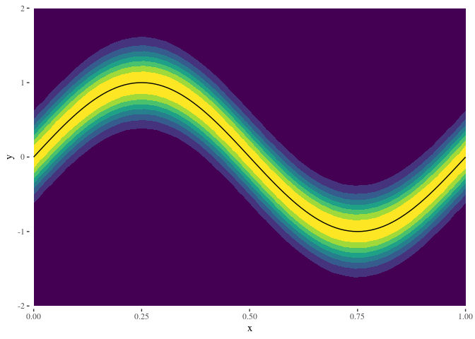
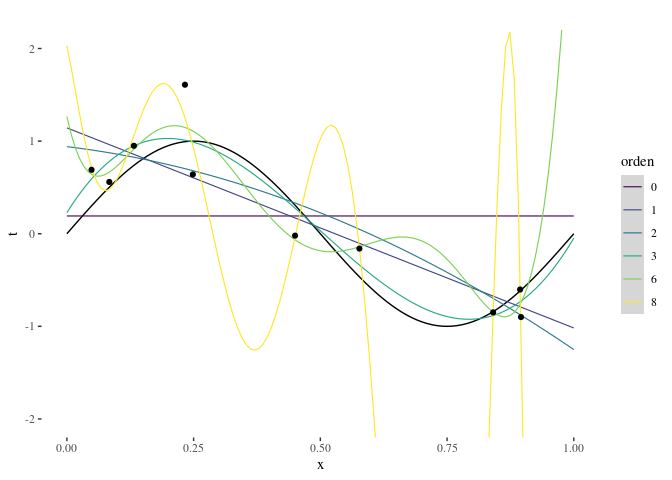
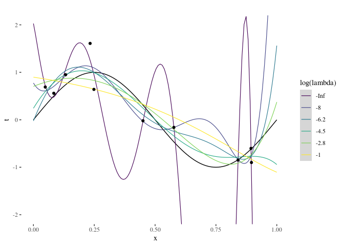
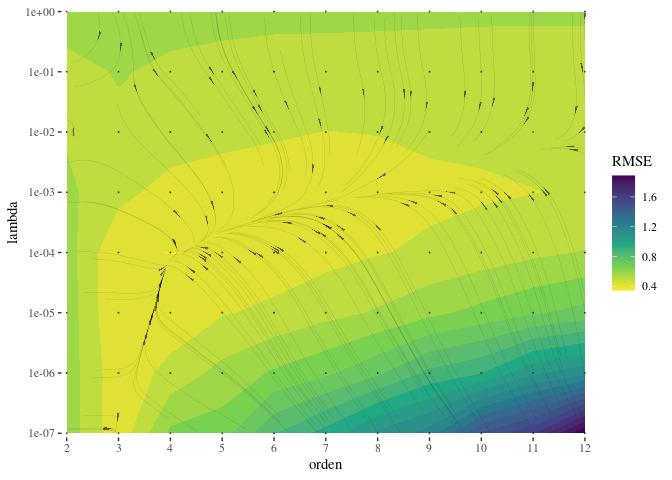
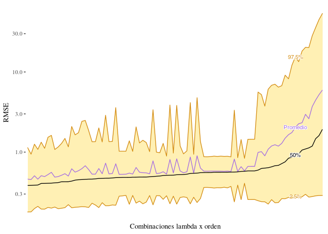
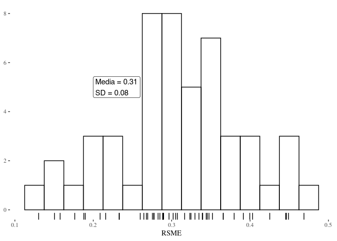

TP1 - Reconocimiento de Patrones
================
Elio Campitelli

# Generar set de datos

Para cada x, los datos a generear siguen una distribución
\(p(x, y) = \mathcal{N}(\mu = \sin(2\pi x), \sigma = 0.3)\). Esta
función de densidad de probabilidad conjunta se muestra en la Figura
<a href="#fig:densidad">1</a>. El mejor ajuste en el sentido de
cuadrados mínimos está dado por
\(\mathrm{h}(x) = \mathbb{E}(y|x) =\sin(2\pi x)\). Ambas funciones
(\(p(x, y)\) y \(\mathbb{E}(y|x)\)) se grafican en la Figura
<a href="#fig:densidad">1</a>.

<div class="figure">



<p class="caption">

Figure 1: Densidad de probabilidad conjunta
\(p(x, y) = \mathcal{N}(\sin(2\pi x), 0.3)\). En negro, la línea
\(\mathbb{E}(y|x)\).

</p>

</div>

La función `D`\[1\] devuelve `L` sets de `n` datos. Éstos corresponden a
la función `FUN` (default: \(\sin(2\pi x)\))) evaluada en `n` puntos
elegidos a partir de una distribución uniforme en el intervalo
`intervalo` (default: \((0, 1)\)) a la que se le suma un ruido gausiano
con media 0 y desvío `sigma` (default: \(0.3\)).

<div class="figure">


<p class="caption">

Figure 2: Cuatro ejemplos de conjuntos de datos generados por la función
`D` con `n = 40`. En línea negra, la función \(t = \sin(2\pi x)\)

</p>

</div>

## Función para calcular la regresión

`regresion_poly`\[2\] tiene argumentos `orden` y `lambda` y devuelve una
función que realiza el ajuste polinomial correspondiente\[3\]. Los
métodos `predictdf` y `predict`\[4\] aplican el ajuste a nuevos datos.

La Figura <a href="#fig:ajustes-orden">3</a> muestra el efecto de
cambiar el orden del polinomio para un set de datos de `n = 10`. Un
polinomio de orden cero es una constante, por lo que el valor predicho
por ese ajuste coincide con el promedio muestral. Polinomio de orden 1
agrega una tendencia, y órdenes mayores van aumentando los grados de
libertad del modelo. Para órdenes altos (cercanos a la cantidad de datos
usados para realizar el ajuste), el modelo es lo suficientemente
complejo para predecir los datos observados con gran exactitud, pero
pierde poder de generalización para datos no observados.

<div class="figure">



<p class="caption">

Figure 3: Ajustes polinomiales con distintos órdenes y lambda = 0 para 1
ejemplo. La línea negra representa la función real. Al aumentar el grado
del polinomio, el ajuste se acerca más a los puntos observados pero
oscila alocadamente lejos de ellos.

</p>

</div>

En cambio, la Figura <a href="#fig:ajustes-lambda">4</a> muestra el
efecto de aumentar el factor de regularización lambda. Al aumentar,
aumenta la penalización de coeficientes altos y el modelo deja de
ajustar tan bien a los datos observados pero mejora la generalización.

<div class="figure">



<p class="caption">

Figure 4: Igual que la figura anterior, pero con orden fijo = 8 y lambda
variable. Al aumentar el factor de regularización, el modelo se
simplifica. Aumenta la diferencia con los datos usados para el ajuste,
pero mejora la generalización.

</p>

</div>

El error cuadrático medio de entrenamiento se calcula como la diferencia
cuadrática media entre los valores observados y los predichos por el
modelo. En la Figura <a href="#fig:rmse-sd">5</a> se muestra un
histograma de la raiz cuadrada del error cuadrático medio\[5\] para 200
muestras de `n = 10` haciendo un ajuste con `orden = 3` y `lambda
= 1e-3`. En el recuadro, el valor medio del RMSE y su desvío estándar.

<div class="figure">


<p class="caption">

Figure 5: Histograma de la raiz del error cuadrático medio computado
para 200 muestras de `n = 10`.

</p>

</div>

## Determinando M y lambda

Para elegir el orden y el lambda se puede usar validación cruzada. Para
cada combinación de los hiperpaŕametros se separa los datos en un
conjunto de *entrenamiento* que se usa para ajustar un modelo y uno de
*validación*, que se usa para evaluar el error del modelo a datos
nuevos. Se busca la combinación que minimice el error de validación y
finalmente se estima el error esperado con el conjunto de *test*.

Esta es la matriz de parámetros donde voy a buscar. Lambda entre 10^-10
y 1, y el orden del polinomio entre 0 y 11

Defino una función para calcular el RSME de validación cruzada\[6\].
Ésta toma un set de datos, una formula que determina el modelo y una
función de regresión (lo que devuelve `regresion_poly()`). Tiene un
argumento `k_fold` (default: 5) que controla la cantidad de cachos. Si
`k_fold = n`, el algoritmo se reduce a LOOCV\[7\]

De los 200 sets de 10 datos voy a usar 150 para la validación cruzada.
Luego, para cda uno de ellos voy a hacer validación cruzada con `k_fold
= 5`, lo que implica usar 8 datos para el ajuste y 2 para la validación.
Este proceso devuelve 150 valores de RMSE de validación cruzada para
cada combinación de lambda y orden del polinomio.

La Figura <a href="#fig:rmse-campo">6</a> muestra la mediana del RMSE de
validación cruzada\[8\] para los valores de lambda y orden. La variación
del error refleja lo visto en las figuras
<a href="#fig:ajustes-orden">3</a> y
<a href="#fig:ajustes-lambda">4</a>, alcanzando el máximo cuando el
orden el polinomio es muy grande y el factor de regularización es muy
pequeño (overfitting). Las líneas de corriente ilustran el campo
vectorial de menos el gradiente. El RMSE se minimiza, entonces, en las
zonas de convergencia de las mismas.

<div class="figure">



<p class="caption">

Figure 6: Mediana del RMSE para cada lambda y orden. En líneas de
corriente, el negativo del gradiente.

</p>

</div>

| lambda | orden | mediana |
| -----: | ----: | ------: |
|  1e-04 |     4 |   0.384 |
|  1e-05 |     3 |   0.385 |
|  1e-04 |     5 |   0.387 |
|  1e-04 |     3 |   0.389 |
|  1e-07 |     3 |   0.407 |

Table 1: Combinación de valores de lambda y orden que minimizan la
mediana del RMSE de validación cruzada

A partir de estos datos se puede elegir la mejor combinación de lambda y
orden. La Tabla <a href="#tab:rmse-mejores">1</a> lista las 5
combinaciones con menor RMSE de validación cruzada medido por la
mediana. Según esta medida, la mejor combinación de hiperparámetros es
lambda = 10^{-4}, orden = 4. Para tener una idea de la robustez de esta
determinación, en la Figura <a href="#fig:rmse-orden">7</a> se ordenan
las combinaciones de hiperparámetros de menor a mayor de acuerdo a la
mediana del RMSE pero también se muestra el intervalo de 95% en
sombreado. Se observa que la variabilidad del RMSE dentro de cada
combinación de hiperparámetros es considerablemente mayor que la
variabilidad de la mediana del RMSE entre distintas combinaciones de
hiperparámetros.

<div class="figure">



<p class="caption">

Figure 7: Mediana (en negro) y promedio (en violeta) del RMSE de
validación cruzada e intervalo de confianza de 95%. Datos ordenados de
menor a mayor a partir de la mediana del RMSE.

</p>

</div>

Una vez elegida la combinación óptima de hiperparámetros (Tabla
<a href="#tab:rmse-mejores">1</a>) lo que sigue es usarlos para ajustar
el modelo con todos los 150 sets de datos usados para validación cruzada
y luego testear el RMSE de test usando los 50 sets de datos que habían
quedado separados para test. La distribución de RSME obtenida se ve en
la Figura <a href="#fig:rmse-test">8</a>.

<div class="figure">



<p class="caption">

Figure 8: Histograma del RSME de test de los 50 sets de datos no
utilizados para validación cruzada.

</p>

</div>

# Apéndice

## Definición de D

``` r
D <- function(n = 10, L = 1, intervalo = c(0, 1), FUN = ~sin(2*pi*.x), sigma = 0.3) {
  datos <- lapply(seq_len(L), function(l) {
    x <- runif(n, intervalo[1], intervalo[2])
    FUN <- purrr::as_mapper(FUN)
    real <- FUN(x)
    t <- real + rnorm(n, sd = sigma)
    return(data.table::data.table(x, t))
  })
  
  return(data.table::rbindlist(datos, idcol = "l"))
}
```

## Definición de regresion\_poly y métodos

``` r
regresion_poly <- function(orden = 1, lambda = 0) {
  force(orden)
  force(lambda)
  
  modelos <- data.table::CJ(orden, lambda)
  
  function(formula, data = NULL, weights) {
    datos <- model.frame(formula, data = data)
    y <- datos[, 1]
    x <- datos[, 2]
    Ws <- lapply(seq_len(nrow(modelos)), function(i) {
      orden <- modelos$orden[i]
      lambda <- modelos$lambda[i]
      # Matriz de diseño
      
      if (orden == 0) {
        A <- cbind(rep(1, length(x)))
      } else {
        A <- cbind(1, poly(x, degree = orden, raw = TRUE))  
      }
      
      if (lambda != 0) {
        L <- diag(1, nrow = ncol(A)) * lambda
        w <- solve(t(A) %*% A + L) %*% t(A) %*% y   # Forma a lo bruto.
      } else {
        w <- qr.coef(qr(A), y)   # Forma eficiente de invertir la matriz
      }
      
      modelo <- list(orden = orden,
                     lambda = lambda,
                     w = w)
      return(modelo)
    })
    
    attr(Ws, "x") <- x
    class(Ws) <- c("regression_models", class(Ws))
    return(Ws)
  }
}
```

``` r
# Métodos para predecir nuevos valores usando la regresion.
predict.regression_models <- function(object, newdata = NULL, which = 1) {
  # browser()
  if (is.null(newdata)) {
    newdata <- attr(object, "x", exact = TRUE)
  }
  
  model <- object[[which]]
  
  if (model$orden == 0) {
    A <- cbind(rep(1, length(newdata))) 
  } else {
    A <- cbind(1, poly(newdata, degree = model$orden, raw = TRUE))
  }
  return((A %*% model$w)[, 1])
}

predictdf.regression_models <- function(object, xseq, se, level) {
  fits <- lapply(seq_along(object), function(o) {
    y <- predict(object, newdata = xseq, which = o)
    return(data.frame(orden = object[[o]]$orden,
                      lambda = object[[o]]$lambda,
                      x = xseq, 
                      y = y))
  })
  
  data <- do.call(rbind, fits)
  data$orden <- factor(data$orden, ordered = TRUE)
  return(data)
}
```

## Definición de rmse\_cv

``` r
rmse_cv <- function(formula, datos, fit_fun, k_fold = 5) {
  N <- nrow(datos)
  
  grupos <- ggplot2::cut_number(seq_len(N), k_fold)
  
  rmses <- vapply(seq_len(k_fold), function(k){
    train_index <- grupos != levels(grupos)[k] 
    train <- datos[train_index == TRUE, ]
    validation <- datos[train_index == FALSE, ]
    model <- fit_fun(formula, data = train)
    validation[, sqrt(mean((t - predict(model, newdata = x))^2))]
  }, numeric(1))
  return(mean(rmses))
}
```

Código completo que genera este informe:
<https://github.com/eliocamp/reconocimiento-de-patrones/blob/master/TP1/README.Rmd>

1.  Definida en el [Apéndice](#def-d).

2.  Definida en el [Apéndice](#def-regr).

3.  Esto es una complicación extra pero vale la pena para poder usar la
    función como argumento de `method` en `geom_smooth()` como se ve en
    la figura siguiente.

4.  Definidos en el [Apéndice](#def-regr).

5.  RMSE: Root Mean Square Error

6.  Definida en el [Apéndice](#def-cv).

7.  Leave One Out Cross-Validation. Es decir, que se ajusta el modelo
    usando todos los datos menos uno.

8.  La distribución del RMSE es asimétrica, por lo que el promedio no es
    una medida de distribución central particularmente buena.
