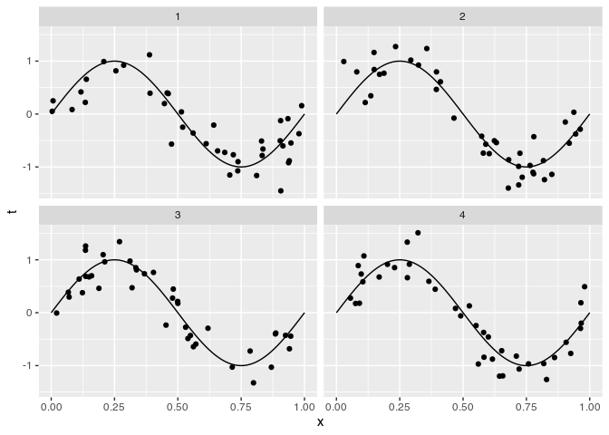

TP1
================
Elio Campitelli
4/17/2020

``` r
library(ggplot2)
library(data.table)
library(magrittr)
set.seed(42)
```

## 1\. Función que geneta un set de datos.

Devuelve una tabla con los lugares `x`, los valores reales `real` y las
obvercaciones `obs` (real + ruido). El argumento `ruido` es el desvio
estándar del
ruido.

``` r
D <- function(n = 10, intervalo = c(0, 1), FUN = ~sin(2*pi*.x), ruido = 0.2) {
  x <- runif(n, intervalo[1], intervalo[2])
  FUN <- purrr::as_mapper(FUN)
  real <- FUN(x)
  obs <- real + rnorm(n, sd = ruido)
  return(data.table::data.table(x, real, obs))
}
```

Ejemplo aleatorio

``` r
D(n = 40) %>% 
  ggplot(aes(x, obs)) +
  stat_function(fun = ~sin(2*pi*.x)) +
  geom_point() +
  scale_x_continuous(limits = c(0, 1))
```



## 2\. Función para calcular la regresión

``` r
regresion_poly <- function(obs, x, orden = 1, lambda = 0) {
  # Matriz de diseño
  A <- cbind(1, poly(x, degree = orden, raw = TRUE))
  
  if (lambda != 0) {
    L <- diag(1, nrow = ncol(A)) * lambda
    w <- solve(t(A) %*% A + t(L) %*% L) %*% t(A) %*% obs    # Forma a lo bruto.
  } else {
    w <- qr.coef(qr(A), obs)   # Forma eficiente de calcular la regresion
  }
  
  # Detalles. 
  class(w) <- c("regression_model")
  attr(w, "orden") <- orden
  attr(w, "x") <- x
  return(w)
}

# Método para predecir nuevos valores usando la regresion.
predict.regression_model <- function(object, newdata = NULL) {
  if (is.null(newdata)) {
    newdata <- attr(object, "x", exact = TRUE)
  }
  
  cbind(1, poly(newdata, degree = attr(object, "orden"), raw = TRUE)) %*% object
}

# Chequear que al menos el resultado sin regularizar coincide on el correcto.
stopifnot({
  d <- D()
  w <- d[, regresion_poly(obs, x, orden = 7)]  
  all.equal(sum(coef(lm(obs ~ poly(x, degree = 7, raw = TRUE), data = d)) - w), 0)
})

# Para ggplot2
fortify.regression_model <- function(model, data, n = 40, ...) {
  x <- seq(0, 1, length.out = n)
  data.frame(x = x, 
             y = predict(model, newdata = seq(0, 1, length.out = 40)))
}
```

Ejemplo con ajuste de orden 3 en rojo y función real en negro.

``` r
datos <- D(n = 10)

ggplot(datos, aes(x, obs)) +
  geom_point() +
  geom_line(aes(x, y), 
            data = datos[, regresion_poly(obs, x, orden = 3)],
            color = "red") +
  stat_function(fun = ~sin(2*pi*.x)) +
  scale_x_continuous(limits = c(0, 1))
```

<!-- -->

## 3\. Determinando M y lambda

Esta es la matriz de parámetros donde voy a buscar. M entre 1 y 10 y
lambra entre 10^-6 y 1

``` r
params <- CJ(lambda = 10^seq(-7, 0, length.out = 15), orden = 1:10)
```

Función para calcular el RMSE de cross-validación. Con k\_fold = 10 se
reduce a LOOCV

``` r
rmse_cv <- function(obs, pred, lambda, orden, k_fold = 10) {
  N <- length(obs)
  
  grupos <- ggplot2::cut_number(seq_along(obs), k_fold)
  data <- data.table(obs, pred)
  
  rmses <- vapply(seq_len(k_fold), function(k){
    train_index <- grupos != levels(grupos)[k] 
    train <- data[train_index == TRUE, ]
    validation <- data[train_index == FALSE, ]
    
    model <- train[, regresion_poly(obs, pred, orden = orden, lambda = lambda)]
    
    validation[, sqrt(mean((obs - predict(model, newdata = pred))^2))]
  }, numeric(1))
  mean(rmses)
}
```

Corriendo todo. Para cada lambda y orden, calculo el
RMSE.

``` r
cv <- params[, .(rmse = rmse_cv(datos$obs, datos$x, lambda = lambda, orden = orden)),
               by = .(lambda, orden)]

ggplot(cv, aes(orden, lambda)) +
  geom_contour_filled(aes(z = log(rmse))) +
  scale_y_log10(expand = c(0, 0)) +
  scale_x_continuous(breaks = 1:10, expand = c(0, 0)) +
  scale_fill_viridis_d("log(rmse)", direction = -1, guide = guide_colorsteps(show.limits = TRUE))
```

<!-- -->

¿Cuál es la “mejor” combinación de hiperparámetros?

``` r
cv[which.min(rmse)]
```

    ##         lambda orden      rmse
    ## 1: 0.003162278     3 0.1637783
