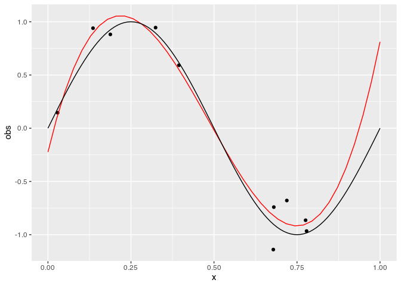
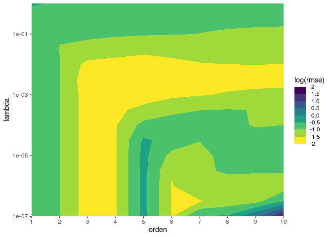
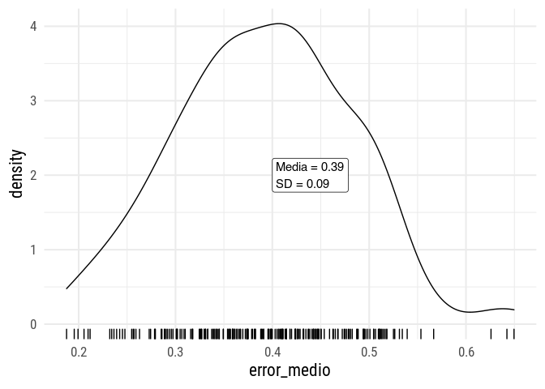

TP1
================
Elio Campitelli
4/17/2020

``` r
library(ggplot2)
library(data.table)
library(magrittr)
theme_set(theme_minimal(base_size= 16, base_family = hrbrthemes::font_rc))

label_null <- as_labeller(function(x) "")

set.seed(42)
```

## 1\. Función que genera un set de datos.

La función `D()` devuelve `L` sets de `n` datos. Éstos correponden a la
función `FUN` evaluada en `n` puntos elegidos a partir de una
distribución uniforme en el intervalo `intervalo` a la que se le suma
un ruido gausiano con media 0 y desvío
`sigma`.

``` r
D <- function(n = 10, L = 1, intervalo = c(0, 1), FUN = ~sin(2*pi*.x), sigma = 0.3) {
  datos <- lapply(seq_len(L), function(l) {
    x <- runif(n, intervalo[1], intervalo[2])
    FUN <- purrr::as_mapper(FUN)
    real <- FUN(x)
    t <- real + rnorm(n, sd = sigma)
    return(data.table::data.table(x, t))
  })
  
  data.table::rbindlist(datos, idcol = "l")
}
```

Ejemplo aleatorio

``` r
datos <- D(n = 40, L = 4)
datos %>% 
  ggplot(aes(x, t)) +
  stat_function(fun = ~sin(2*pi*.x)) +
  geom_point() +
  scale_x_continuous(limits = c(0, 1)) +
  facet_wrap(~l, labeller = label_null)
```


## 2\. Función para calcular la regresión

`regresion_poly` tiene argumentos `orden` y `lambda` y devuelve una
función que realiza el ajuste polinomial correspondiente. Los métodos
`predictdf` y `predict` aplican el ajuste a nuevod datos.

``` r
regresion_poly <- function(orden = 1, lambda = 0) {
  force(orden)
  force(lambda)
  
  function(formula, data = NULL, weights) {
    datos <- model.frame(formula, data = data)
    y <- datos[, 1]
    x <- datos[, 2]
    # browser()
    Ws <- lapply(orden, function(o) {
      # Matriz de diseños
      if (o == 0) {
        A <- cbind(rep(1, length(x)))
      } else {
        A <- cbind(1, poly(x, degree = o, raw = TRUE))  
      }
      
      
      if (lambda != 0) {
        L <- diag(1, nrow = ncol(A)) * lambda
        w <- solve(t(A) %*% A + L) %*% t(A) %*% y   # Forma a lo bruto.
      } else {
        w <- qr.coef(qr(A), y)   # Forma eficiente de calcular la regresion
      }
      
      modelo <- list(orden = o, 
                     w = w)
      return(modelo)
    })
    
    attr(Ws, "x") <- x
    class(Ws) <- c("regression_models", class(Ws))
    return(Ws)
  }
}


# Métodos para predecir nuevos valores usando la regresion.
predict.regression_models <- function(object, newdata = NULL, which = 1) {
  # browser()
  if (is.null(newdata)) {
    newdata <- attr(object, "x", exact = TRUE)
  }
  
  model <- object[[which]]
  
  if (model$orden == 0) {
    A <- cbind(rep(1, length(newdata))) 
  } else {
    A <- cbind(1, poly(newdata, degree = model$orden, raw = TRUE))
  }
  return((A %*% model$w)[, 1])
}

predictdf.regression_models <- function(object, xseq, se, level) {
  fits <- lapply(seq_along(object), function(o) {
    y <- predict(object, newdata = xseq, which = o)
    return(data.frame(orden = object[[o]]$orden,
                      x = xseq, 
                      y = y))
  })
  
  data <- do.call(rbind, fits)
  data$orden <- factor(data$orden, ordered = TRUE)
  return(data)
}
```

``` r
datos <- D(n = 10, L = 200)

ggplot(datos[l %in% 1:4], aes(x, t)) +
  stat_function(fun = ~sin(2*pi*.x), size = 1) +
  geom_smooth(method = regresion_poly(c(0:3, 6, 8)), 
              aes(color = ..orden.., group = ..orden..),
              size = 0.6, fullrange = TRUE, n = 120) +
  geom_point()  +
  scale_x_continuous(limits = c(0, 1)) +
  coord_cartesian(ylim = c(-2, 2)) +
  facet_wrap(~l, labeller = label_null)
```

    ## `geom_smooth()` using formula 'y ~ x'


En la Figura~@ref{fig:ajustes}
blababal

``` r
datos[, pred := predict(regresion_poly(orden = 3, lambda = 1e-3)(t ~ x)), by = l] %>% 
  .[, .(error_medio = sqrt(mean((t - pred)^2))), by = l] %>% 
  ggplot(aes(error_medio)) +
  geom_density() +
  geom_label(data = ~.x[, .(mu = mean(error_medio), s = sd(error_medio))],
             aes(label = glue::glue("Media = {signif(mu, 2)}\nSD = {signif(s, 2)}")),
             x = 0.3, y = 3, hjust = 0) +
  geom_rug()
```

<!-- -->

## 3\. Determinando M y lambda

Esta es la matriz de parámetros donde voy a buscar. M entre 1 y 10 y
lambra entre 10^-6 y 1

``` r
params <- CJ(lambda = 10^seq(-6, 0, length.out = 15), orden = 0:10)
```

Función para calcular el RMSE de cross-validación. Con k\_fold = 10 se
reduce a LOOCV

``` r
rmse_cv <- function(y, x, lambda, orden, k_fold = 10) {
  N <- length(y)
  
  grupos <- ggplot2::cut_number(seq_along(y), k_fold)
  data <- data.table(y, x)
  
  rmses <- vapply(seq_len(k_fold), function(k){
    train_index <- grupos != levels(grupos)[k] 
    train <- data[train_index == TRUE, ]
    validation <- data[train_index == FALSE, ]
    
    model <- train[, regresion_poly(orden = orden, lambda = lambda)(y ~ x)]
    
    validation[, sqrt(mean((y - predict(model, newdata = x))^2))]
  }, numeric(1))
  mean(rmses)
}
```

Corriendo todo. Para cada lambda y orden, calculo el
RMSE.

``` r
cv <- params[, .(rmse = rmse_cv(datos[l == 1]$t, datos[l == 1]$x, lambda = lambda, orden = orden)),
             by = .(lambda, orden)]

ggplot(cv, aes(orden, lambda)) +
  geom_contour_filled(aes(z = log(rmse))) +
  scale_y_log10(expand = c(0, 0)) +
  scale_x_continuous(breaks = unique(cv$orden), expand = c(0, 0)) +
  scale_fill_viridis_d("log(rmse)", direction = -1,
                       guide = guide_colorsteps(show.limits = TRUE))
```

<!-- -->

¿Cuál es la “mejor” combinación de hiperparámetros?

``` r
(mejor <- cv[which.min(rmse)])
```

    ##          lambda orden    rmse
    ## 1: 0.0003727594     3 0.29653

``` r
modelo <- datos[l == 1, regresion_poly(orden = mejor$orden, lambda = mejor$lambda)(t ~ x)]

datos[l != 1] %>% 
  .[, pred := predict(modelo, newdata = x), by = l] %>% 
  .[, .(error_medio = sqrt(mean((t - pred)^2))), by = l] %>% 
  ggplot(aes(error_medio)) +
  geom_density() +
  geom_label(data = ~.x[, .(mu = mean(error_medio), s = sd(error_medio))],
             aes(label = glue::glue("Media = {signif(mu, 2)}\nSD = {signif(s, 2)}")),
             x = 0.4, y = 2, hjust = 0) +
  geom_rug()
```

<!-- -->
