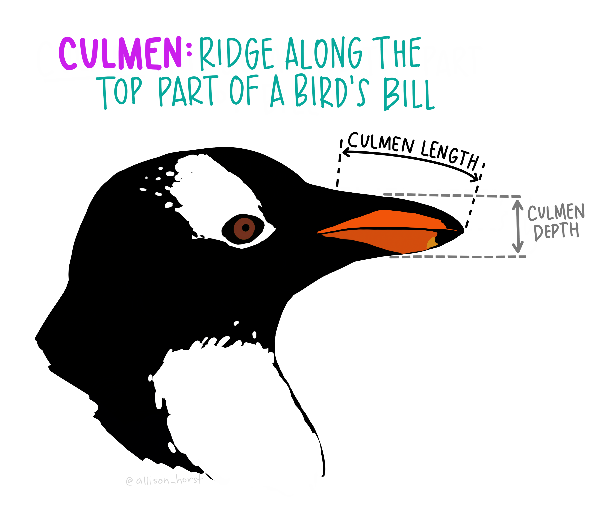

```{r setup, include = FALSE}
library(ggplot2)
library(data.table)
library(magrittr)
library(patchwork)
library(palmerpenguins)
library(kableExtra)


theme_set(ggthemes::theme_tufte())
knitr::opts_chunk$set(tidy = FALSE, message = FALSE, warning = FALSE, 
                      cache = TRUE, cache.extra = 1, echo = FALSE, fig.align = "center")

label_null <- as_labeller(function(x) "")

scale_color_penguin <- scale_fill_manual(values = c(adelaida = "darkorange", 
                                                    barbijo = "purple", 
                                                    juanito = "cyan4"), aesthetics = c("color", "fill"))

update_geom_defaults(GeomPoint, list(size = 0.5))
set.seed(42)
```


```{r}
data(penguins)
penguins <- na.omit(as.data.table(penguins)[, -c("island", "sex")]) %>% 
  .[, species := forcats::fct_recode(species, adelaida = "Adelie", 
                                     barbijo = "Chinstrap",
                                     juanito = "Gentoo")] 

setnames(penguins, colnames(penguins), c("especie", "culmen_longitud", "culmen_alto", "aleta_largo", "masa"))
```

# Datos

En este TP voy a estar usando la base de datos `penguins` del paquete de R **palmerpenguins** [@R-palmerpenguins]. Los datos recolectados por la Dra. Kristen Gorman en la Estación Palmer, consisten en mediciones de la longitud del culmen^[El culmen es la parte superior del pico de las aves ], alto del culmen y la masa corporal de `r nrow(penguins)` pingüinos de las especies *Pygoscelis adeliae* (Pingüino de Adelaida), *Pygoscelis papua* (Pingüino Juanito), y *Pygoscelis antarcticus* (Pingüino barbijo).

```{r, fig.align="center", out.width="80%"}

```


En la Tabla \@ref(tab:pen-glance) se muestran las primeras 3 mediciones para cada especie.

```{r pen-glance}
knitr::kable(penguins[, head(.SD, 3), by = especie], booktabs = TRUE,
             col.names = c("Especie", "Longitud de culmen [mm]", "Alto de culmen [mm]", 
                           "Longitud de la aleta [mm]", "Masa corporal [g]"),
             caption = "Primeras 3 entradas de cada especie en los datos utilizados") %>% 
  column_spec(2:5, width = "2cm")
```


La variable categórica a predecir va a ser la especie, y las posibles variables predictoras son las dimensiones del culmen, la longitud de la aleta y la masa corporal. Es decir, en principio es un espacio de dimensión 4. Como la idea es trabajar en $\mathbb{R}^2$, conviene explorar qué grado de separación permite cada combinación de dos variables. Esto se muestra en la Figura \@ref(fig:pairs) donde se grafican scatterplots para todas las combinaciones de dos variables con la especie representada con color. Mirando las densidades de probabilidad (gráficos en la diagonal) se puede ver que la longitud del culmen separa bastante bien entre pingüino de adelaida y el resto mientras que las otras variables separan bien al pingüino juanito. Por lo tanto, las combinaciones que incluyen la longitud del culmen (gráficos en la primera columna) separan bastante bien entre las tres especies, mientras que el resto de las combinaciones tienen algún grado de mezcla entre pingüino de adelaida y pingüino juanito.


```{r pairs, fig.cap = "Scatteplot de todas las combinaciones de variables posibles en $\\mathbb{R}^2$. En la diagonal, estimaciones de densidad de cada variable separadas por especies.", fig.height=4, fig.width=6, fig.fullwidth = TRUE}
ggplot(penguins, aes(.panel_x, .panel_y)) +
  geom_point(aes(color = especie), size = 0.1) +
  ggforce::geom_autodensity(aes(fill = especie), alpha = 0.6, position = "dodge") +
  ggforce::facet_matrix(vars(culmen_longitud:masa),
                        layer.diag = 2) +
  scale_color_penguin +
  theme(legend.position = "bottom")

```

En lo que sigue, voy a usar los datos de Longitud de culmen y de alto del culmen para separar entre las tres especies. 

```{r}
data <- penguins[, .(z = factor(especie), 
                     x = culmen_longitud, 
                     y = culmen_alto)] %>% 
  na.omit()

x <- "Longitud de culmen [mm]"
y <- "Alto de culmen [mm]"
z <- "Especie"

ejes <- list(labs(x = x, y = y, fill = z, color = z))
```


```{r}
# ggplot(data, aes(x, y)) +
#   geom_point(aes(color = z)) +
#   ejes +
#   directlabels::geom_dl(aes(label = z, color = z), method = "smart.grid") +
#   
#   scale_color_penguin +
#   guides(fill = "none", color = "none")
```


# Clasificador cuadrático


```{r}

clasificador_cuadratico <- function(formula, data = environment(formula)) { 
  # one-hot encoding de las categorías
  data <- model.frame(formula, data)
  formula_hot <- paste0("~ 0 + ", deparse(formula[[2]]))
  hot <- model.matrix(as.formula(formula_hot), data = data)
  
  # datos de predictores
  bare_data <- model.matrix(formula, data)[, -1]
  bare_data_scaled <- scale(bare_data)
  
  center <- attr(bare_data_scaled, "scaled:center")
  sd <- attr(bare_data_scaled, "scaled:scale")
  
  bare_data_scaled <- cbind(1, bare_data_scaled)
  # fiteando el modelo
  model <- .lm.fit(bare_data_scaled, as.matrix(hot))
  
  structure(.Data = model$coefficients,
            levels = levels(data[[deparse(formula[[2]])]]),
            formula = formula, 
            center = center, 
            sd = sd,
            class = "cuadratico")
}


predict.cuadratico <- function(object, newdata, ...) {
  formula <- attr(object, "formula", TRUE)
  formula <- delete.response(terms(formula))
  sd <- attr(object, "sd", TRUE)
  center <- attr(object, "center", TRUE)
  
  bare_data <- as.matrix(model.frame(formula, newdata, na.action = NULL))
  bare_data <- cbind(1, scale(bare_data, center = center, scale = sd))
  
  levels <- attr(object, "levels", TRUE)
  pred <- bare_data %*% object
  factor(levels[max.col(pred)], levels = levels)
}
```


```{r}


W <- clasificador_cuadratico(z ~ x + y, data)

data$pred <- predict(W, data)

div <- expand.grid(x = seq(min(data$x), max(data$x), length.out = 140), 
                   y = seq(min(data$y), max(data$y), length.out = 140))

div$pred <- predict(W, div)


ggplot(data, aes(x, y)) +
  geom_raster(aes(fill = pred), data = div, alpha = 0.4) +
  geom_point(aes(color = z)) +
  scale_color_penguin +
  ejes +
  guides(fill = "none", color = "none") +
  coord_fixed(2)
```


```{r, fig.height=9, fig.width=6}
density2d <- function(x, y, group, bandiwdths, ...) {
  xy <- na.omit(data.table(x, y, group))
  xy_scaled <- scale(xy[, c("x", "y")])
  center <- attr(xy_scaled, "scaled:center")
  sd <- attr(xy_scaled, "scaled:scale")
  
  lims <- c(apply(xy_scaled, 2, range))
  
  base_bandwidth <- mean(c(MASS::bandwidth.nrd(xy_scaled[, 1]),
                           MASS::bandwidth.nrd(xy_scaled[, 2])))
  
  bandwidths <- bandiwdths*base_bandwidth
  
  xy_scaled <- as.data.table(xy_scaled)
  xy_scaled$group <- xy$group
  
  density <- function(x, y, h) {  
    d <- MASS::kde2d(x, y, h = h, lims = lims, n = 200)
    dimnames(d$z) <-  list(x = d$x, 
                           y = d$y)
    res <- reshape2::melt(d$z)  
    res$bandwidth <- h
    res
  }
  
  out <- xy_scaled[, rbindlist(lapply(bandwidths, function(h) density(x, y, h))), by = group]
  
  out[, x := x*sd[1] + center[1]]
  out[, y := y*sd[2] + center[2]]
  out[]
}


density <- data[, density2d(x, y, z, c(1/4, 1, 4))]

ggplot(data, aes(x, y)) +
  geom_raster(data = density[, .(z = group[which.max(value)]), by = .(x, y, bandwidth)],
              aes(x, y, fill = z), alpha  = 0.4) +
  geom_contour(data = density, aes(x, y, z = value, color = group), size = 0.3, alpha = 0.4) +
  geom_point(aes(color = z), size = 0.1) +
  scale_color_penguin +
  ejes +
  coord_fixed(2) +
  guides(fill = "none", color = "none") +
  facet_grid(bandwidth~., labeller = labeller(bandwidth = function(x) paste0("Ancho de banda = ",
                                                                             signif(as.numeric(x), 3)))) 
```


## Fisher

```{r}
data_bk <- data
```


```{r}
data <- data_bk
formula <- z ~ x + y

fischer <- function(group, ...) {
  data <- cbind(data.table::data.table(group = group), 
                data.table::data.table(...))
  data <- na.omit(data)
  
  
  data_split <- split(data, data$group, drop = TRUE)
  
  
  means <- lapply(data_split, function(dat) {
    X <- dat[, -1]
    colMeans(X)
  })
  
  
  S <- lapply(seq_along(data_split), function(i) {
    cov(as.matrix(data_split[[i]][, -1])) * (nrow(data_split[[i]]) - 1)
  })
  
  W <- solve(Reduce("+", S)) %*% Reduce("-", means)
  structure(.Data = W, 
            class = "fischer",
            levels = levels(data),
            pred_names = colnames(data))
}

predict.fischer <- function(object, newdata) {
  
  data <- newdata[, attr(object, "pred_names", TRUE)]
  proj <- as.matrix(data) %*% object
  
}

```


```{r}
d <- data[z != "juanito"]

f <- with(d, fischer(z, x, y))

d$proj <- as.matrix(d[, .(x, y)]) %*% f

```


```{r}
ggplot(d, aes(x, y)) +
  geom_point(aes(color = z))

ggplot(d, aes(proj)) +
  geom_density(aes(color = z, fill = z), alpha = 0.5) +
  geom_rug(aes(color = z)) +
  scale_color_penguin 
```

## Logística

```{r}
sigmoid = function(x) {
  1 / (1 + exp(-x))
}


X_raw <- as.matrix(d[, .(x, y)])
X <- scale(X_raw)
t <- matrix(d[, as.numeric(z == "barbijo")], ncol = 1)

solve_sigmoid <- function(X, t, conv_tol = 1e-4, max_iter = 1e4) {
  
  W <- matrix(rep(0, ncol(X)), nrow = ncol(X), ncol = 1)
  hist <- list(W)
  converged <- FALSE
  
  for (i in seq_len(max_iter)) {
    y <- sigmoid(t(t(W) %*% t(X)))
    y[y == 1] <- 1 - 1e-9
    y[y == 0] <- 0 + 1e-9
    R <- diag(as.vector(y*(1-y)), nrow = length(y))
    R_inv <- diag(1/as.vector(y*(1-y)), nrow = length(y))
    Z <-  X %*% W - R_inv %*% (y - t)
    
    W_new <- solve(t(X) %*% R %*% X) %*% t(X) %*% R %*% Z  
    
    rel_change <- abs(W - W_new)/abs(W)
    converged <- all(rel_change <= conv_tol)
    
    browser(expr = is.na(converged))
    if (is.na(converged) || converged) {
      break
    }
    
    W <- W_new
    hist[[i + 1]] <- W
  }
  # browser()
  list(W = hist, converged = converged)
}


logistica <- function(formula, data, conv_tol = 1e-4, max_iter = 1e4) {
  # one-hot encoding de las categorías
  frame <- model.frame(formula, data)
  t <- as.numeric(frame[, 1] == levels(frame[, 1])[1])
  
  # datos de predictores
  bare_data <- model.matrix(formula, data)
  
  sd <- apply(bare_data, 2, sd, na.rm = TRUE)
  sd[1] <- 1
  means <- apply(bare_data, 2, mean, na.rm = TRUE)
  means[1] <- 0
  
  bare_data_scaled <- scale(bare_data, center = means, scale = sd)
  
  center <- attr(bare_data_scaled, "scaled:center")
  sd <- attr(bare_data_scaled, "scaled:scale")
  
  W <- solve_sigmoid(bare_data_scaled, t, conv_tol = conv_tol, max_iter = max_iter)
  # browser()
  if (is.na(W$converged) || !W$converged) {
    warning("Iteration didn't converge!")
  }
  
  structure(.Data = W$W,
            levels = levels(frame[, 1]),
            formula = formula, 
            center = center, 
            sd = sd,
            converged = W$converged,
            class = "logistica")
}

predict.logistica <- function(object, 
                              newdata, type = c("prediction", "sigmoid"), n = length(object),
                              cutoff = 0.5) {
  formula <- attr(object, "formula", TRUE)
  formula <- delete.response(terms(formula))
  sd <- attr(object, "sd", TRUE)
  center <- attr(object, "center", TRUE)
  
  bare_data <- as.matrix(model.matrix(formula, newdata, na.action = NULL))
  bare_data <- scale(bare_data, center = center, scale = sd)
  
  levels <- attr(object, "levels", TRUE)
  
  lapply(n, function(i) {
    W <- object[[i]]
    # browser()
    pred <- t(t(W) %*% t(bare_data))
    if (type[1] == "prediction") {
      pred <- sigmoid(pred)
      pred <- factor(levels[-sign(pred - cutoff)/2 + 1.5], levels = levels)
    } else if (type[1] == "sigmoid") {
      pred <- sigmoid(pred)
    } 
    return(pred)
  })
}


model <- logistica(z ~ x + y, data = d)


div <- expand.grid(x = seq(min(d$x), max(d$x), length.out = 40), 
                   y = seq(min(d$y), max(d$y), length.out = 40))
preds <- predict(model, div, type = "sigmoid", n = seq_along(model))


hist <- lapply(preds, function(p) {
  d <- div
  d$pred <- p
  d
}) %>% 
  rbindlist(idcol = "iter")

ggplot(d, aes(x, y)) +
  geom_raster(aes(fill = pred), data = hist, interpolate = TRUE) +
  # geom_contour(aes(z = pred), data = hist, breaks = 0.5) +
  geom_point(aes(color = z)) +
  # scale_color_penguin +
  # ejes +
  # guides(fill = "none", color = "none") +
  # coord_fixed(2) +
  gganimate::transition_states(iter, state_length = 0) +
  labs(subtitle = "Iteración: {previous_state}")
```


```{r}

data_elip <- data
data_elip$z <- factor(data$z == "barbijo")

model <- logistica(z ~ x + y + I(x^2) + I(y^2) + I(x*y), data = data_elip)


div <- expand.grid(x = seq(min(data_elip$x), max(data_elip$x), length.out = 40), 
                   y = seq(min(data_elip$y), max(data_elip$y), length.out = 40))

preds <- predict(model, div, type = "sigmoid", n = seq_along(model))


hist <- lapply(preds, function(p) {
  d <- div
  d$pred <- p
  d
}) %>% 
  rbindlist(idcol = "iter")

ggplot(data_elip, aes(x, y)) +
  # geom_raster(aes(fill = pred), data = div, alpha = 0.4) +
  geom_raster(aes(fill = pred), data = hist, alpha = 0.4, interpolate = TRUE) +
  geom_point(aes(color = z)) +
  # scale_color_penguin +
  ejes +
  # guides(fill = "none", color = "none") +
  coord_fixed(2) +
  gganimate::transition_states(iter, state_length = 0) +
  labs(subtitle = "Iteración: {previous_state}")
```


# Expectation Maximisation


```{r}
# datos falsos
# set.seed(12314)
k = 3
ks <- seq_len(k)
M <- 2
real_mu <- lapply(ks, function(x) rnorm(M, sd = 4))
real_sigma <- lapply(ks, function(x) {
  A <- matrix(rnorm(4), nrow = M)
  A <- t(A) %*% A
  A/(A[1, 1] + A[2, 2])
})

datos <- lapply(seq_len(k), function(i) {
  as.data.table(mvtnorm::rmvnorm(floor(runif(1, 50, 70)), mean = real_mu[[i]], sigma = real_sigma[[i]]))
}) %>% 
  rbindlist(idcol = "k") %>% 
  setnames(c("V1", "V2"), c("x", "y"))
ggplot(datos, aes(x, y)) +
  geom_point(aes(color = factor(k)))
```


```{r}

data_scaled <- as.data.table(scale(data[, .(x, y)]))
data_scaled$z <- data$z
# EM <- function() {
tol <- 1e-6
n_iter <- 1e5


k <- 3 # cantidad de clases
ks <- seq_len(k)
M <- 2 # cantidad de features
N <- nrow(data) # cantidad de obs
D <- as.matrix(data_scaled[, .(x, y)])

pi <- rep(1/k, k)
mu <- lapply(ks, function(x) rnorm(M))
sigma <- lapply(ks, function(x) diag(1/k^2, nrow = M))
log_ver <- Inf
h <- log_ver
resp_hist <- list()
mu_hist <- list()
sigma_hist <- list()
distr_hist <- list()

for (iter in seq_len(n_iter)) {
  resp <- lapply(ks, function(i) {
    pi[[i]]*mvtnorm::dmvnorm(D, mean = mu[[i]], sigma = sigma[[i]])
  })
  
  resp_norm <- Reduce("+", resp)
  resp <- lapply(ks, function(i) resp[[i]]/resp_norm)
  
  resp_hist[[iter]] <- lapply(resp, function(r) {
    d <- data_scaled
    d$resp <- r
    d}) %>% 
    rbindlist(idcol = "class") 
  
  
  
  Nk <- unlist(lapply(ks, function(i) sum(resp[[i]])))
  pi <- Nk/N
  mu <- lapply(ks, function(i) colSums(D * resp[[i]])/Nk[[i]])
  sigma <- lapply(ks, function(i) t(D - mu[[i]]) %*% ( (D - mu[[i]]) * resp[[i]] )/Nk[[i]])
  
  distr_hist[[iter]] <- lapply(ks, function(i) {
    list(sigma = sigma[[i]],
         mu = mu[[i]])})
  mu_hist[[iter]] <- as.data.table(transpose(mu))[, class := 1:.N]
  sigma_hist[[iter]] <- sigma
  
  log_ver_new <- lapply(ks, function(i) {
    pi[[i]]*mvtnorm::dmvnorm(D, mean = mu[[i]], sigma = sigma[[i]])
  }) %>% 
    Reduce("+", .) %>% 
    log() %>% 
    sum()
  
  
  h <- c(h, log_ver_new)
  
  converged <- abs((log_ver - log_ver_new)/(log_ver_new)) <= tol
  
  if (converged) {
    break
  }
  log_ver <- log_ver_new
}


# }

```


```{r}
elipses <- lapply(distr_hist, function(i) {
  lapply(i, function(k) {
    as.data.table(ellipse::ellipse(k$sigma, centre = k$mu))
  }) %>% 
    rbindlist(idcol = "class")
}) %>% 
  rbindlist(idcol = "iter")

data_scaled %>% 
  ggplot(aes(x, y)) +
  geom_point(aes(color = factor(z))) +
  geom_path(data = elipses, aes(x, y, group = class)) +
  geom_point(data = rbindlist(mu_hist, idcol = "iter"),
             aes(V1, V2), size = 3) +
  scale_color_viridis_d() +
  gganimate::transition_states(iter) +
  labs(caption = "Iteración: {previous_state}")
```


```{r}
# data_scaled %>% 
#   ggplot(aes(x, y)) +
#   geom_point(aes(color = resp)) +
#   coord_equal()
```


# Referencias